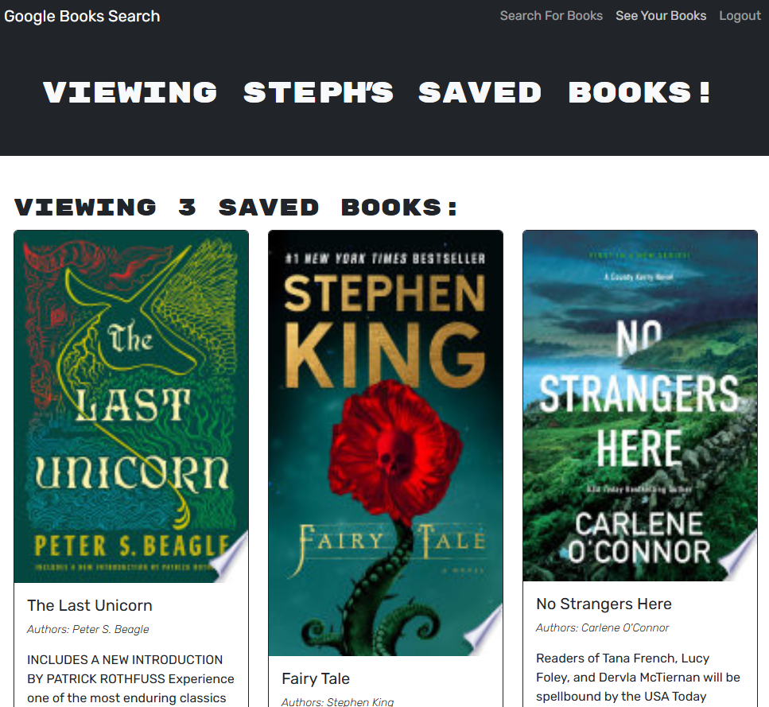

# React Book Search Engine 

## 📖Description
The **React Book Search Engine** is a full-stack MERN(MongoDB, Express, React, Node.js) application that allows users to search for books using the Google Books API. Users can create an account, save books to their personal library, and manage their reading list.

[Click here](https://book-collections.onrender.com) to view the application!

(NOTE: It will take a while for the app to load when opening it ☕)
## Table of Contents

- [Installation](#installation)
- [Usage](#usage)
- [Credits](#credits)
- [License](#license)

## Installation

For installation follow these steps:

1) Clone the repository to your local machine with **git clone**.
2) Install the dependencies using `npm install`.
3) Create a `.env` file in your server directory and add the following:
```sh
MONGODB_URI='mongodb://127.0.0.1:27017/googlebooks'
JWT_SECRET_KEY=''
``` 
4) Build the application by using `npm run build`.
## Usage

- On the main root directory run `npm run start:dev`
- Once taken to the page you can search for books using the search bar.
- You can create an account by clicking on "Sign up".
- Click "Save" to add books to your collections (requires login).
- manage your saved books from your profile page.
- you can remove books from your personal collection.
- Once your done you can click "Log Out" to log out of your account.

It should be presented like the picture below:




## 📜License
This application is covered under [](https://opensource.org/licenses/MIT)

## Features
✅ Search for books using the Google Books API

✅ Save books to your personal collection

✅ Remove books from your saved list

✅ User authentication with JWT

✅ GraphQL API with Apollo Server

✅ Responsive and user-friendly UI

## How to Contribute
🚀 Developed by [stephanuh](https://github.com/stephanuh/Book-Search)
